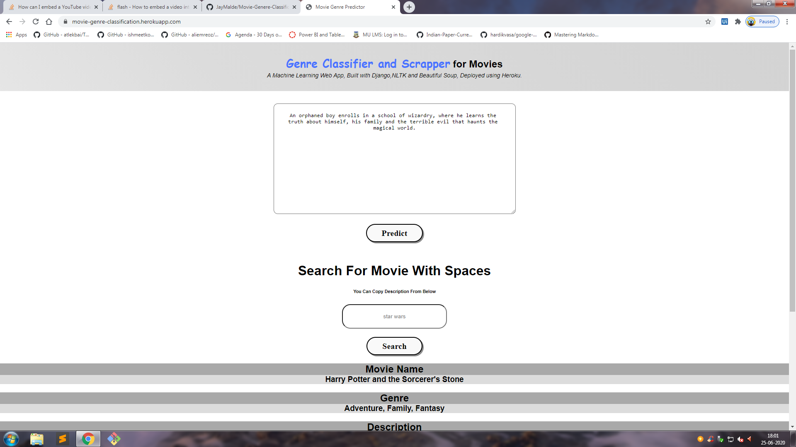

# Movie Genere Classification

## Demo
Link: [https://movie-genre-classification.herokuapp.com](https://movie-genre-classification.herokuapp.com/) (It will not work after 1 month)

## Watch A Turorial By Clicking On This Link
[](https://www.youtube.com/watch?v=svEFW9gLU2E "Movie Genre Classification using NLP")

## Overview
This is a simple movie genere classification and scraping website built on django and the trained model takes text as input and predicts the genre.

## Technical Aspect
This project is divided into two part:-
1. Training a machine learning model and create a web application :-
    * HTML as Front End.
    * Python as Back End with Django.
    * bs4 for Scraping.
    * SKLearn for using Naive Bayes Classifier.
2. Building and hosting a Django web app on Heroku:-
    * for hosting i am using heroku platform as a service.
    * Used django-heroku library for simplifying the process and imported it into the settings.py file.
    * Created requirements.txt and Procfile for deployment.
    * Used Heroku CLI for deploying the application and pushed the code to heroku git.

## Installation
The Code is written in Python 3.6 If you don't have Python installed you can find it [here](https://www.python.org/downloads/). If you are using a lower version of Python you can run this or upgrade using the pip package, ensuring you have the latest version of pip. To install the required packages and libraries, run this command in the project directory after [cloning](https://www.howtogeek.com/451360/how-to-clone-a-github-repository/) the repository:-
```bash
pip install -r requirements.txt
```
##
After cloning check that all the libraries are installed or use the .idea environment given in the repo.
For running the same project go to the project folder where the **manage.py** file is located and run the following command into the command prompt:-
```bash
python manage.py runserver
```

## Directory Tree 
```
├── .idea 
├── movie_genere_prediction (application folder)
│   ├── movie_genere_classification
|       ├── migrations
|       ├── templates (html files are stored here)
|       ├── admin.py (admin related data is stored here)
|       ├── apps.py (information related to this application is stored here)
|       ├── models.py (database information is stored here)
|       ├── tests.py 
|       ├── urls.py (urls related to this project are stored here)
|       └── views.py (the working of each url is stored in a view)
│   ├── movie_genere_prediction (project folder)
│       ├── asgi.py
|       ├── settings.py (main file where all the information is stored)
|       ├── urls.py (urls are redirected to urls file of application)
|       └── wsgi.py (this file is used to run the project when deploying)
|   ├── requirements.txt
|   ├── cv-transform.pkl (dataset model)
|   ├── kaggle_movie_train.csv (dataset)
|   ├── Procfile (it contains info on how to run the application when deployed)
|   ├── README.md (markdown file or documentation of this project)
|   ├── trainer.py (file which contains how the model and dataset is transformed)
|   ├── manage.py (this file is used to run the project on client side)
|   └── movie-genre-mnb-model.pkl (pickle model of naive bayes classifier)
```
